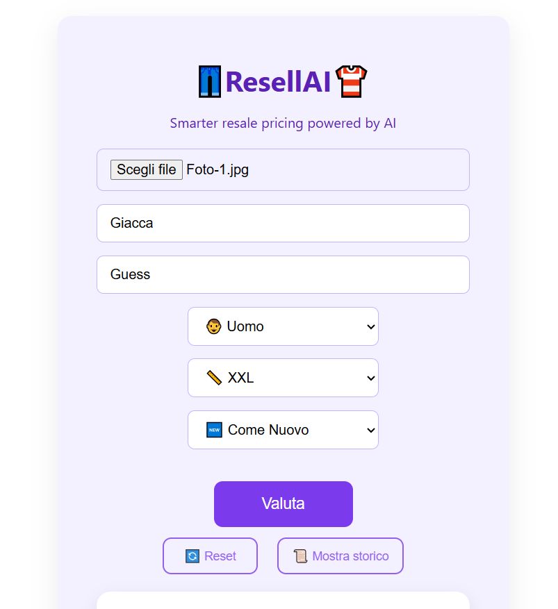
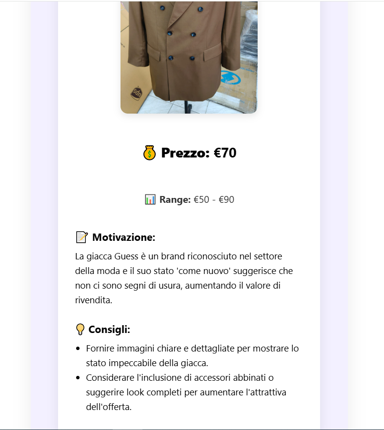

<!-- # 🎨 LookBook AI – Frontend

[](https://lookbook-frontend.vercel.app/)

Frontend dell’applicazione **LookBook AI**, che permette agli utenti di inserire i dati di un capo di abbigliamento e ottenere una valutazione tramite intelligenza artificiale. -->

# 👖 ResellAI Frontend 👕

Applicazione web sviluppata con React che permette di stimare il prezzo di capi di abbigliamento usati tramite intelligenza artificiale.

L’utente inserisce le informazioni del prodotto e riceve una valutazione dinamica con prezzo, range e consigli di vendita.

---

## 🚀 Demo Live

👉 https://resellai-frontend.vercel.app/

⚠️ Il primo caricamento potrebbe richiedere qualche secondo (Render free tier)

---

## 📸 Screenshot

### 🏠 Inserimento prodotto



### 🤖 Risultato AI



---

## 🧰 Tecnologie utilizzate

- React
- Vite
- JavaScript (ES6+)
- CSS3
- REST API custom (Node.js + Express backend)
- OpenAI API

---

## ✨ Funzionalità principali

- 🔍 Valutazione prezzo tramite AI  
- 🧠 Motivazione e consigli di vendita  
- 🖼️ Upload immagine con preview  
- ⚡ Spinner di caricamento con overlay  
- 📜 Storico valutazioni (con possibilità di svuotarlo)  
- 🔎 Autocomplete per brand  
- ✅ Validazione campi con feedback visivo  
- 📱 UI semplice e responsive  

---

## 🧠 Come funziona

1. Frontend raccoglie input utente  
2. Invia POST /valuta al backend 
3. Backend chiama OpenAI API
4. Backend salva su Supabase 
5. Frontend renderizza risultato

---

## 📂 Struttura del progetto
```
vite-project/
│
├── src/
│ ├── components/
│ │ └── ResultCard.jsx
│ ├── services/
│ │ └── api.js
│ ├── App.jsx
│ ├── App.css
│ └── main.jsx
│
├── index.html
└── package.json
```
---

## ⚙️ Installazione


npm install


---

## ▶️ Avvio in locale


npm run dev


App disponibile su:


http://localhost:5173


---

## 🔗 Connessione Backend

Il frontend comunica con il backend tramite variabile d’ambiente:


VITE_BACKEND_URL=https://resellai-backend.onrender.com

---

## 🌐 Deploy

- Frontend deployato su Vercel  
- Backend su Render  

---

## ✨ Autore

Luciano Pacini
🦁Fullstack in crescita